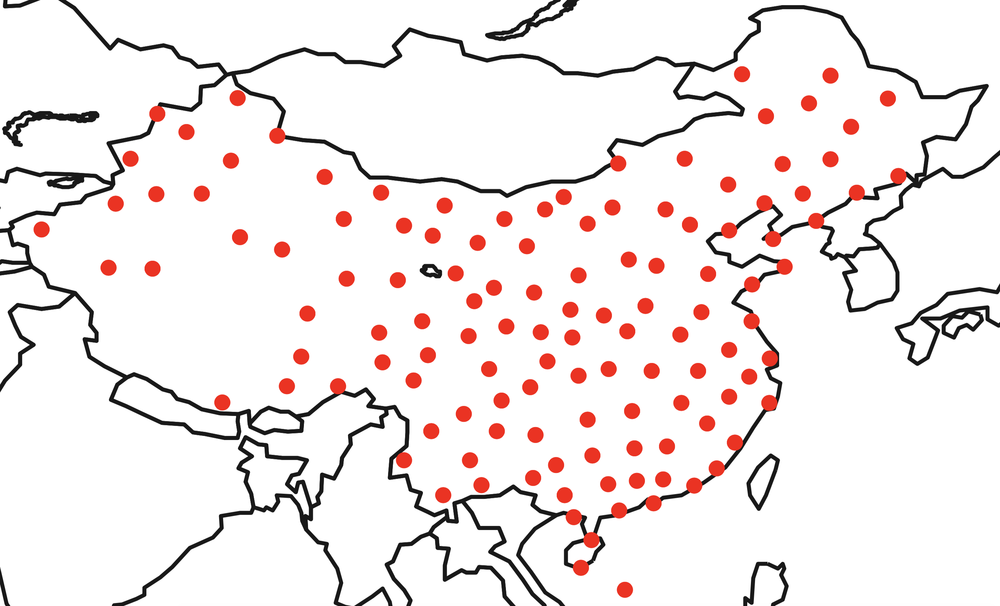
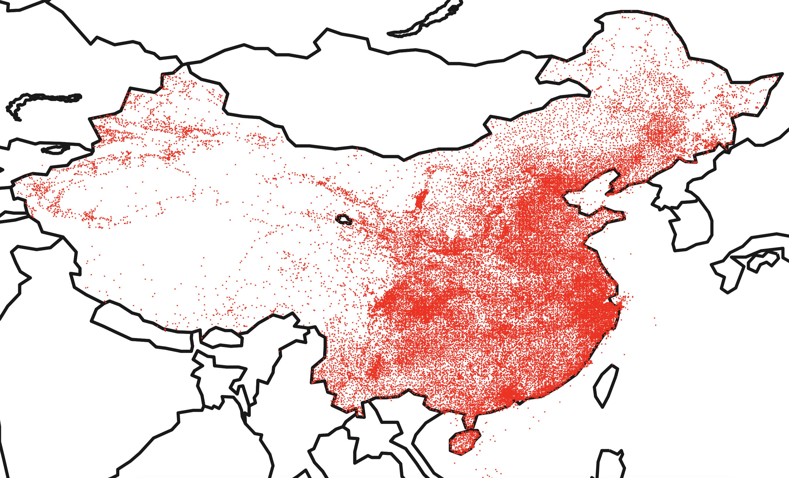
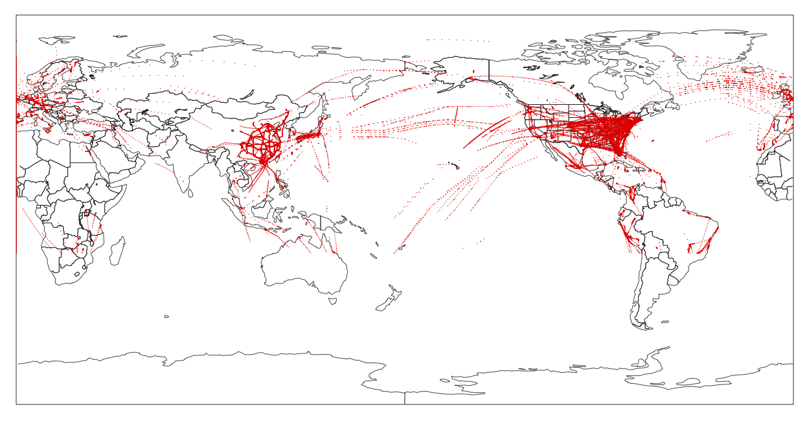

===================
运行步骤
===================

.. contents ::

观测的解码
^^^^^^^^^^
    
    请参考 :doc:`观测的解码 <../decoders/index>` 

下载全球模式预报资料
^^^^^^^^^^^^^^^^^^^^^^^^^^^

    * 下载地址
        * :code:`ftp://ftp.ncep.noaa.gov/pub/data/nccf/com/gfs/prod/gdas.ccyymmdd/`
        * :code:`ftp://ftp.ncep.noaa.gov/pub/data/nccf/com/gfs/prod/gfs.ccyymmdd/`
    * 下载文件：
        * :code:`gdas.t??z.atmf???.nemsio`
        * :code:`gfs.t??z.atmf???.nemsio`
    * 具体下载那些文件，由分析的 :code:`cycle` 决定

运行 **dump** 和 **obsproc**
^^^^^^^^^^^^^^^^^^^^^^^^^^^^

.. code-block :: bash

    > cd /nwpprod
    > ./run_obsproc.py -s 2018120100 -e 2018121512

:code:`run_obsproc.py` 的内容如下：

.. code-block :: python

    #!/usr/bin/python
    # -*- coding: UTF-8 -*-
    
    import argparse
    from datetime import datetime, timedelta
    import os
    import sys

    parser = argparse.ArgumentParser()                                               

    parser.add_argument("--start", "-s", type=str, required=True)
    parser.add_argument("--end", "-e", type=str, required=True)

    args = parser.parse_args()

    start_time = datetime.strptime(args.start, "%Y%m%d%H")
    end_time   = datetime.strptime(args.end, "%Y%m%d%H")

    current_time = start_time

    while (current_time <= end_time):
        print "Processing : ", current_time
        cyc = current_time.strftime("%H");
        com_date = "/nwprod/com/date/t" + cyc + "z"
        with open(com_date, "w") as file:
           file.write("nwprod" + current_time.strftime("%Y%m%d%H"))
        with open(com_date, "r") as file:
           print file.read()
        os.system("run_rap_obsproc.bash " + cyc)
        #print("run_rap_obsproc.bash " + cyc)
        current_time = current_time + timedelta(hours=12)

:code:`run_obsproc.py` 通过修改 :code:`/nwprod/com/date/t??z` 文件，来指令质控程序对哪个时间的观测资料进行质控；

:code:`run_obsproc.py` 调用 :code:`run_rap_obsproc.bash`, :code:`run_rap_obsproc.bash` 会读取 :code:`/nwprod/com/date/t??z` 的内容， 并且从命令行获取 :code:`cyc` 来得到时间信息；

:code:`run_rap_obsproc.bash` 会进一步设置各种参数来控制质控，内容如下:

.. code-block :: bash

    > cat run_rap_obsproc.bash 
    #!/bin/bash -e

    ulimit -s unlimited

    if [[ $# -eq 0 ]]; then
      echo "No cycle is given"
      echo "Usage:: run_rap_obsproc.bash 00"
      exit
    fi

    # Common setting
    export ROOT_DIR=/nwprod
    export NWROOT=${ROOT_DIR}
    export DATAROOT=${ROOT_DIR}/tmpprod
    export COMIN_ROOT=${ROOT_DIR}/com
    export COMROOT=${ROOT_DIR}/com

    # default root directory path to $TANK
    export DCOMROOT=${ROOT_DIR}/dcom

    # Where is the utility scripts
    export UTILROOT=${ROOT_DIR}/util
    export utilscript=${ROOT_DIR}/util/ush

    export NDATE=${UTILROOT}/exec/ndate
    export NHOUR=${UTILROOT}/exec/nhour

    export grib_util_ver=1.0.5

    # Run locally and background threads
    export sys_tp="local"
    export launcher="background"

    # root directory tree for the path to temporary work files
    export TMPDIR=/tmp

    # Geographical filtering of the data
    export LALO=0

    # 
    export RUN_ENVIR="nco"
    export envir="prod"

    export KEEPDATA="NO"
    export LOUD="off"

    ############################################
    # SENDCOM  - Copy files to $COMOUT directory
    # SENDECF  - Flag Events on ECFLOW
    # SENDDBN  - Alert output file to TOC
    ############################################
    export SENDCOM=YES
    export SENDECF=NO
    export SENDDBN=NO

    export PROCESS_GRIBFLDS="NO"
    export PROCESS_REMOREST="NO"

    # Only conventional data being processed
    export JOB_NUMBER=1

    # Which group will be processed
    export DUMP_group2="YES"
    export DUMP_group3="YES"
    export DUMP_group4="NO"
    export DUMP_group5="NO"

    export MPMD=NO
    export CHGRP_RSTPROD=NO

    export POE="NO"

    export NET="rap"
    export cyc=$1
    export job=${NET}_dump_${cyc}

    . ${ROOT_DIR}/versions/obsproc_rap.ver
    ${ROOT_DIR}/obsproc_rap.v3.0.0/jobs/JRAP_DUMP
    ${ROOT_DIR}/obsproc_rap.v3.0.0/jobs/JRAP_DUMP_POST

    export GETGUESS="YES"
    export NEMSIO_IN=.true.
    export job=${NET}_obsproc_${cyc}
    export GESROOT=/nwprod/com/gfs
    ${ROOT_DIR}/obsproc_rap.v3.0.0/jobs/JRAP_PREP

检查运行结果
^^^^^^^^^^^^^^^^^^^

.. code :: bash

    > find /nwprod/com/rap -name rap.t??z.prepbufr.tm00 -exec ls -la {} \;
    -rw-r--r--. 1 zwtd zwtd 142960 Dec 17 17:17 /nwprod/com/rap/prod/rap.20180706/rap.t00z.prepbufr.tm00
    -rw-r--r--. 1 zwtd zwtd 102472 Dec 17 13:19 /nwprod/com/rap/prod/rap.20180430/rap.t00z.prepbufr.tm00
    -rw-r--r--. 1 zwtd zwtd 114824 Dec 17 16:32 /nwprod/com/rap/prod/rap.20180430/rap.t12z.prepbufr.tm00
    -rw-r--r--. 1 zwtd zwtd 125584 Dec 17 16:33 /nwprod/com/rap/prod/rap.20180501/rap.t00z.prepbufr.tm00
    -rw-r--r--. 1 zwtd zwtd 159824 Dec 17 16:33 /nwprod/com/rap/prod/rap.20180501/rap.t12z.prepbufr.tm00
    -rw-r--r--. 1 zwtd zwtd 130096 Dec 17 16:34 /nwprod/com/rap/prod/rap.20180502/rap.t00z.prepbufr.tm00
    -rw-r--r--. 1 zwtd zwtd 166208 Dec 17 16:34 /nwprod/com/rap/prod/rap.20180502/rap.t12z.prepbufr.tm00
    -rw-r--r--. 1 zwtd zwtd 163704 Dec 17 16:35 /nwprod/com/rap/prod/rap.20180503/rap.t00z.prepbufr.tm00
    -rw-r--r--. 1 zwtd zwtd 171776 Dec 17 16:35 /nwprod/com/rap/prod/rap.20180503/rap.t12z.prepbufr.tm00
    -rw-r--r--. 1 zwtd zwtd 152832 Dec 17 16:36 /nwprod/com/rap/prod/rap.20180504/rap.t00z.prepbufr.tm00
    -rw-r--r--. 1 zwtd zwtd 159344 Dec 17 16:37 /nwprod/com/rap/prod/rap.20180504/rap.t12z.prepbufr.tm00
    ...
    ...

观测资料的分布
^^^^^^^^^^^^^^^^

利用 :code:`MET` 的绘图功能，可以绘制各种观测的分布， 例如：

   探空观测的分布（2018121612  +/- 1.0 hour）

   地面观测的分布（2018121612 +/- 1.0 hour）

   飞机观测的分布（2018121612 +/- 1.0 hour）